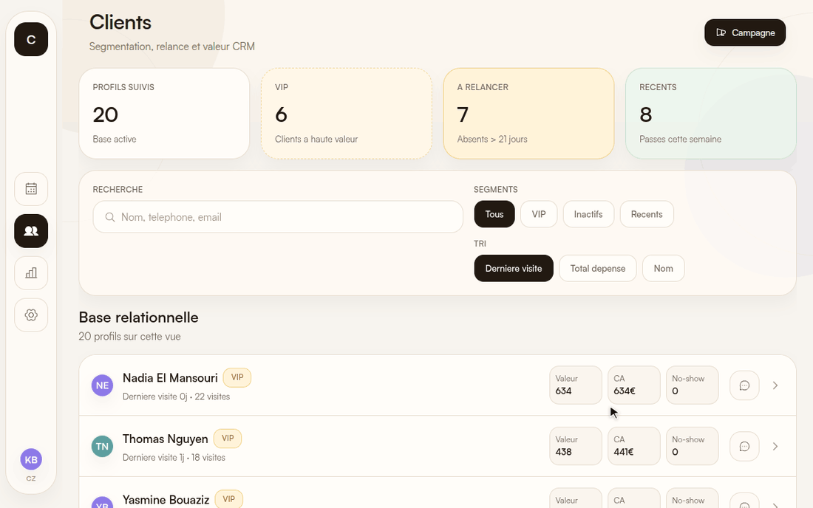
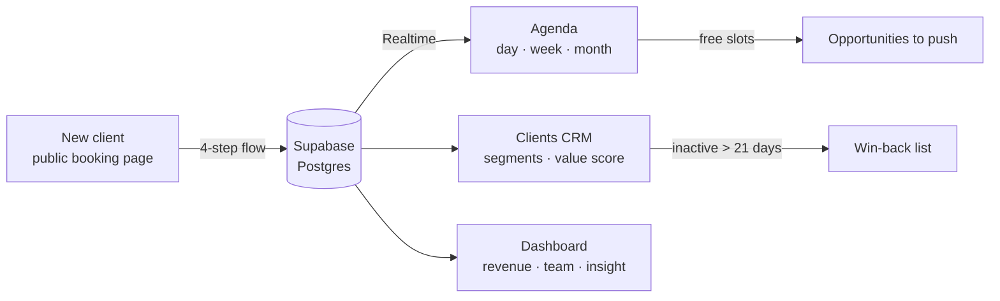
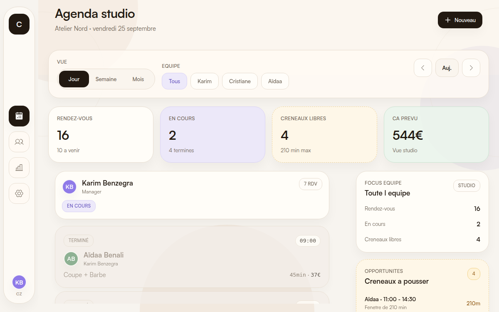

<p align="center">
  
</p>

# Cizo

**The salon app that keeps the chairs full: spot the clients drifting away, and let new ones book themselves in four taps.**


## What it does

- **Public booking page, no account needed.** Each salon gets a link (`/booking/<salon>`): service → day and slot → contact details → confirmation. New clients opt in to WhatsApp reminders and offers as they book.
- **A CRM built for win-back.** Every client carries visit count, spend, no-shows and a value score. One tap isolates the ones who haven't come back in 21+ days, the VIPs, or this week's newcomers.
- **A live agenda that sells its empty chairs.** Day, week and month views per stylist, appointments in progress, delays, and an "opportunities" rail that lists the free slots worth pushing.
- **A dashboard for the owner.** Revenue against the daily target, team stats, KPI cards and a plain-language insight of the day.
- **One codebase, three screens.** Phone, tablet and web from the same Expo Router app, with a sidebar on large screens and a tab bar on phones.

## How it works



Screens are Expo Router routes; data flows through TanStack Query hooks (`hooks/`) and small Zustand stores (`stores/`). Supabase holds salons, staff, services, clients and appointments (`supabase/migrations`), and its Realtime channel pushes agenda changes to every open device. When no Supabase project is configured, the app switches to a **demo mode**: auth is bypassed and every screen runs on a built-in fictional salon whose dates are shifted to today, so it always looks live.

<p align="center">
  
</p>

## Stack

Expo 54 · React Native 0.81 / React 19 · Expo Router · TypeScript · TanStack Query · Zustand · Supabase (Postgres, Auth, Realtime) · Phosphor icons.

## Run it locally

Requires Node 20+.

```bash
npm ci
npx expo start --web     # or: npx expo start, then open on iOS / Android
```

With no `.env`, the app starts in demo mode with sample data. To connect a real backend, copy `.env.example` to `.env`, fill `EXPO_PUBLIC_SUPABASE_URL` and `EXPO_PUBLIC_SUPABASE_ANON_KEY`, and apply `supabase/migrations/001_initial_schema.sql` (optionally `supabase/seed.sql`).

Type-check: `npm run typecheck`.

## Project structure

```
app/
  (tabs)/          Agenda, Clients, Dashboard, Settings
  booking/         Public booking page and appointment view
  client/[id].tsx  Client profile
  campaign/        WhatsApp campaigns (next milestone)
components/        agenda, booking, clients, dashboard, layout, common UI
hooks/             Data hooks (agenda, clients, dashboard, booking flow, realtime)
stores/            Zustand stores (auth, agenda, clients, salon, timer)
lib/               Supabase client, design constants, demo data
supabase/          SQL schema and seed
types/             Domain types
```

## Roadmap

WhatsApp messaging from a client profile, segmented win-back campaigns with message preview, and revenue attribution per campaign.

## Credits

Designed and built by [Scarville](https://github.com/Sc4rville).

## License

[MIT](LICENSE) © Scarville
